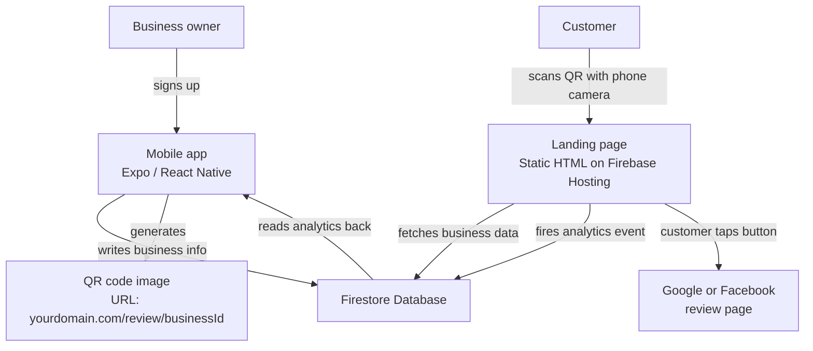
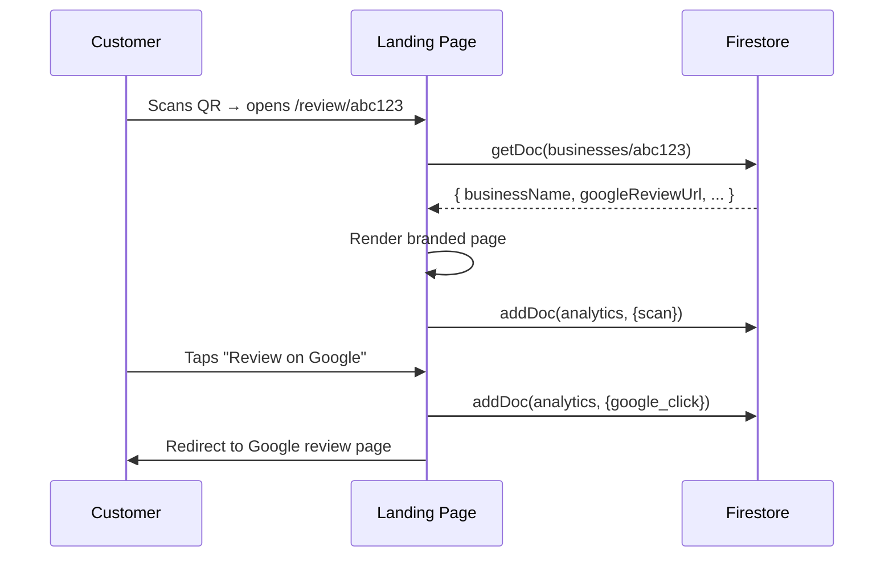
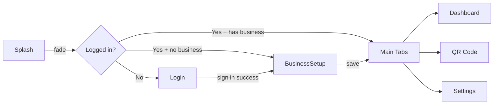

# Building Scan & Say — A Step-by-Step Build Journal

> **Purpose of this document**
> This is a from-scratch playbook for shipping a mobile app like Scan & Say. It's written so you (or future you) can repeat this build faster next time, and avoid the gotchas the first time around.
>
> Each section has three things:
> - **The steps** — exactly what to click/type
> - **🎯 Why** — what the step actually does, so you understand it instead of copy-pasting blindly
> - **⚠️ Watch out** — the gotchas to skip past
>
> **Tech stack:** Expo (React Native) for mobile, static HTML + Firebase Hosting for the customer landing page, Firebase Auth + Firestore for backend.

---

## Table of Contents

1. [Big-picture architecture](#1-big-picture-architecture)
2. [Project setup](#2-project-setup)
3. [Firebase configuration](#3-firebase-configuration)
4. [Building the landing page](#4-building-the-landing-page)
5. [Building the mobile app](#5-building-the-mobile-app)
6. [Design system](#6-design-system)
7. [Production build with EAS](#7-production-build-with-eas)
8. [Google OAuth setup](#8-google-oauth-setup)
9. [Pre-launch checklist](#9-pre-launch-checklist)
10. [Lessons learned](#10-lessons-learned-the-cheat-sheet)

---

## 1. Big-picture architecture

Before writing code, understand what you're building. A 5-minute mental model now saves hours later.



**Two separate products talking to one database:**
- **Mobile app** — for the business owner (sign in, manage business, see stats)
- **Landing page** — for the customer (no login, just a redirect)
- **Firestore** — the shared database that connects them

**🎯 Why this split:** the landing page must be public (no login) because customers won't download your app. By separating the customer flow into a static web page, you cut the customer's friction to zero — they don't even know your app exists.

---

## 2. Project setup

### Folder structure to start with

```
YourProject/
├── landing/          # Static HTML/JS — Firebase Hosting
│   ├── public/
│   │   ├── index.html
│   │   ├── styles.css
│   │   ├── app.js
│   │   └── firebase-config.js
│   ├── firebase.json
│   └── .firebaserc
├── mobile/           # Expo React Native app
│   ├── App.js
│   ├── app.json
│   ├── eas.json
│   ├── package.json
│   ├── babel.config.js
│   ├── metro.config.js
│   ├── assets/
│   └── src/
│       ├── firebase.js
│       ├── theme.js
│       ├── components/
│       └── screens/
└── README.md
```

**🎯 Why two folders, not a monorepo:** simpler. Each project has its own dependencies, its own deploy command, its own concerns. Monorepos add complexity you don't need yet.

### Prerequisites to install

```bash
# Node.js LTS (v20 or later) — download from https://nodejs.org

# Verify install
node --version

# Global tools
npm install -g firebase-tools     # to deploy landing page
npm install -g eas-cli             # to build the mobile app
```

**⚠️ Watch out:** if `node --version` shows v18 or older, install the latest LTS. Expo SDK 54 needs at least Node 18.

---

## 3. Firebase configuration

Firebase is a backend-as-a-service. We use three of its features:
- **Authentication** — handles sign-in
- **Firestore** — NoSQL database
- **Hosting** — serves the landing page

### Step-by-step (the right order)

#### a. Create the project

1. Go to https://console.firebase.google.com
2. Click **Add project** → name it → continue
3. **Turn off Google Analytics** for now (you don't need it for MVP)
4. Wait for project creation

#### b. Enable Authentication

1. Sidebar → **Build → Authentication**
2. Click **Get started**
3. Click **Email/Password** → toggle **Enable** → Save

#### c. Create Firestore

1. Sidebar → **Build → Firestore Database**
2. Click **Create database**
3. Pick a region near your users (this is permanent — choose wisely)
4. Choose **Start in production mode** → Create

**🎯 Why production mode:** the alternative ("test mode") locks down or opens up your database in a way you don't want. Production mode + your custom security rules = total control.

#### d. Register a web app + get your config

1. Top of project page → click the **gear icon** → **Project settings**
2. Scroll to **Your apps** → click the **`</>`** (web) icon
3. **Don't check** "Firebase Hosting" (we'll set up hosting separately)
4. Copy the `firebaseConfig` object — looks like this:

```javascript
const firebaseConfig = {
  apiKey: "AIzaSy...",
  authDomain: "yourproject.firebaseapp.com",
  projectId: "yourproject-12345",
  storageBucket: "yourproject.firebasestorage.app",
  messagingSenderId: "123456789",
  appId: "1:123:web:abc"
};
```

**⚠️ Watch out:** the `apiKey` looks like a secret but **it's not** — it's a public identifier that Firebase rules govern. Don't worry about it being visible in browser code.

#### e. Write Firestore security rules

Create `landing/firestore.rules`:

```
rules_version = '2';
service cloud.firestore {
  match /databases/{database}/documents {
    match /users/{userId} {
      allow read, write: if request.auth != null && request.auth.uid == userId;
    }
    match /businesses/{businessId} {
      allow read: if true;
      allow create: if request.auth != null && request.resource.data.ownerId == request.auth.uid;
      allow update, delete: if request.auth != null && resource.data.ownerId == request.auth.uid;
    }
    match /analytics/{eventId} {
      allow create: if true;
      allow read: if request.auth != null
        && get(/databases/$(database)/documents/businesses/$(resource.data.businessId)).data.ownerId == request.auth.uid;
    }
  }
}
```

**🎯 Why these specific rules:**
- `users` → only the user themselves can read/write their own user doc
- `businesses` → public **read** (so the landing page works without auth), owner-only writes
- `analytics` → public **create** (so any customer can fire a scan event), but only the business owner can read their own analytics

**This is the key insight:** for the customer flow to work without forcing them to log in, *some* data has to be publicly readable. Embrace it — just don't put secrets there.

---

## 4. Building the landing page

### File: `landing/public/index.html`

A single HTML file that:
1. Reads the `businessId` from the URL (`/review/abc123`)
2. Fetches the business doc from Firestore
3. Shows the branded review buttons
4. Fires analytics on scan + click

### Architecture



### Two critical files

**`landing/public/firebase-config.js`** — the only place your Firebase config lives:
```javascript
export const firebaseConfig = {
  apiKey: "...",
  // ...etc
};
```

**`landing/firebase.json`** — tells Firebase Hosting how to route URLs:
```json
{
  "hosting": {
    "public": "public",
    "rewrites": [
      { "source": "/review/**", "destination": "/index.html" }
    ]
  },
  "firestore": {
    "rules": "firestore.rules"
  }
}
```

**🎯 Why the rewrite:** Firebase Hosting serves files based on URL paths. Without the rewrite, `/review/abc123` would 404. The rewrite says "any URL under /review/ should serve index.html, and let the JavaScript figure out what to do with the path."

### Deploy

```bash
cd landing
firebase login
firebase deploy --only hosting,firestore:rules
```

Output ends with:
```
Hosting URL: https://yourproject.web.app
```

**⚠️ Watch out for collection name typos.** Firestore is case-sensitive and exact-match. If your code reads `businesses` but you create a `business` collection (singular), the doc will not be found. The error you'll see is silent — `doc.exists()` will return `false` and your "not found" state will show. **Always double-check collection names match exactly.**

---

## 5. Building the mobile app

### Initialize an Expo project

```bash
cd YourProject
npx create-expo-app@latest mobile --template blank
cd mobile
```

**🎯 Why Expo over bare React Native:** Expo manages native build complexity, includes useful SDK modules (camera, file system, sharing), and lets you ship without ever opening Xcode or Android Studio. You give up some flexibility but for 95% of apps, the tradeoff is worth it.

### Install the dependencies you'll actually use

```bash
# Core packages
npm install firebase
npx expo install @react-native-async-storage/async-storage

# Navigation
npm install @react-navigation/native @react-navigation/native-stack @react-navigation/bottom-tabs
npx expo install react-native-screens react-native-safe-area-context react-native-gesture-handler

# QR generation + image capture
npm install react-native-qrcode-svg
npx expo install react-native-svg react-native-view-shot

# Save QR to device + share
npx expo install expo-media-library expo-sharing expo-file-system

# Visual polish
npx expo install expo-linear-gradient expo-font @expo-google-fonts/archivo-black @react-native-masked-view/masked-view

# Google sign-in (optional)
npx expo install expo-auth-session expo-web-browser expo-crypto
```

**⚠️ Always use `npx expo install` (not `npm install`) for Expo-managed packages.** It pins the exact version that works with your current Expo SDK. Using `npm install` without this can get you a newer version that breaks the build.

### The `metro.config.js` Firebase fix (CRITICAL)

When you use Firebase v9+ with Expo SDK 50+, you'll get an error: **"Component auth has not been registered yet."**

Cause: Metro (Expo's bundler) uses the new "package exports" resolution by default. Firebase doesn't define a React Native export path. The auth module fails to register.

Fix: create `mobile/metro.config.js`:

```javascript
const { getDefaultConfig } = require('expo/metro-config');
const config = getDefaultConfig(__dirname);

config.resolver.sourceExts.push('cjs');
config.resolver.unstable_enablePackageExports = false;

module.exports = config;
```

**🎯 Why this works:** disabling package exports forces Metro to fall back to the older `main`/`browser` resolution, which correctly loads Firebase's React Native auth module. Adding `cjs` to sourceExts lets it find Firebase's CommonJS files.

**This is a known issue. Just always do it.**

### Firebase init (mobile-side)

`mobile/src/firebase.js`:
```javascript
import { initializeApp } from 'firebase/app';
import { initializeAuth, getReactNativePersistence } from 'firebase/auth';
import { getFirestore } from 'firebase/firestore';
import AsyncStorage from '@react-native-async-storage/async-storage';

const firebaseConfig = {
  // paste your config here
};

export const LANDING_BASE_URL = 'https://yourproject.web.app';

export const app = initializeApp(firebaseConfig);
export const auth = initializeAuth(app, {
  persistence: getReactNativePersistence(AsyncStorage),
});
export const db = getFirestore(app);
```

**🎯 Why initializeAuth instead of getAuth:** `getAuth()` doesn't persist sessions across app restarts on React Native. `initializeAuth` + AsyncStorage persistence means users stay logged in.

### Navigation structure



In `App.js`:
```javascript
const Stack = createNativeStackNavigator();
const Tab = createBottomTabNavigator();

<Stack.Navigator screenOptions={{ headerShown: false }}>
  <Stack.Screen name="Splash" component={SplashScreen}
    options={{ animation: 'fade', animationDuration: 400 }} />
  <Stack.Screen name="Login" component={LoginScreen}
    options={{ animation: 'fade', animationDuration: 400 }} />
  <Stack.Screen name="BusinessSetup" component={BusinessSetupScreen} />
  <Stack.Screen name="Main" component={MainTabs}
    options={{ animation: 'fade', animationDuration: 350 }} />
</Stack.Navigator>
```

**🎯 Why fade transitions:** sliding transitions feel wrong for splash → login (you're not "going forward," you're just appearing). Fade is the standard for auth flow transitions.

### The QR generation pattern

```javascript
import QRCode from 'react-native-qrcode-svg';
import ViewShot, { captureRef } from 'react-native-view-shot';
import * as MediaLibrary from 'expo-media-library';

const viewShotRef = useRef();

// In your JSX:
<ViewShot ref={viewShotRef} options={{ format: 'png', quality: 1 }}>
  <QRCode value={qrUrl} size={240} />
</ViewShot>

// To save:
async function downloadQr() {
  const perm = await MediaLibrary.requestPermissionsAsync(true);
  if (perm.status !== 'granted') return;
  const uri = await captureRef(viewShotRef, { format: 'png', quality: 1, result: 'tmpfile' });
  await MediaLibrary.createAssetAsync(uri);
}
```

**⚠️ Don't use `MediaLibrary.saveToLibraryAsync` on Android — it silently fails on some versions. Use `createAssetAsync` instead.**

**🎯 Why request permission with `(true)`:** that's "write-only" mode. It avoids asking for read permission you don't need, which is friendlier and reduces user fear.

---

## 6. Design system

### Pick your brand colors first, then enforce them everywhere

`mobile/src/theme.js`:
```javascript
export const colors = {
  gradientStart: '#4F6DFF',
  gradientEnd: '#9B30FF',
  text: '#1A1A1A',
  muted: '#6B7280',
  white: '#FFFFFF',
  bg: '#F5F5F7',
  danger: '#DC2626',
  border: '#E5E7EB',
};

export const gradient = [colors.gradientStart, colors.gradientEnd];

export const shadow = {
  shadowColor: '#000',
  shadowOpacity: 0.08,
  shadowRadius: 8,
  shadowOffset: { width: 0, height: 2 },
  elevation: 3,
};
```

**🎯 Why one file:** changing the gradient in one place updates the entire app. Without this, you'll find yourself hunting through 20 files when the brand changes.

### Use gradients with intention, not decoration

**Bad:** gradient on every header bar — becomes background noise, the user stops seeing it.

**Good:** gradient on **the one thing per screen that matters most**:
- The hero number on Dashboard (Total Scans card)
- The primary call-to-action button
- The brand wordmark (RT.)

When gradient is rare, it gains meaning. When it's everywhere, it gains nothing.

### The Wordmark + GradientText pattern (reusable)

`mobile/src/components/GradientText.js`:
```javascript
import MaskedView from '@react-native-masked-view/masked-view';
import { LinearGradient } from 'expo-linear-gradient';

export default function GradientText({ style, children }) {
  return (
    <MaskedView maskElement={<Text style={[style, { backgroundColor: 'transparent' }]}>{children}</Text>}>
      <LinearGradient colors={gradient} start={{ x: 0, y: 0 }} end={{ x: 1, y: 0 }}>
        <Text style={[style, { opacity: 0 }]}>{children}</Text>
      </LinearGradient>
    </MaskedView>
  );
}
```

**🎯 Why MaskedView + opacity 0:** the trick to gradient text in React Native is layering. The visible text is the gradient image; the actual text just shapes the mask. The opacity-0 text below sets the layout dimensions.

### SafeAreaView, always

Every screen that touches the top of the screen must be wrapped:

```javascript
import { SafeAreaView } from 'react-native-safe-area-context';

<SafeAreaView edges={['top', 'left', 'right']}>
  {/* screen content */}
</SafeAreaView>
```

**🎯 Why:** modern phones have notches, holes, gesture nav. Without SafeAreaView, content sits under them and looks broken.

**⚠️ The version that works:** `react-native-safe-area-context` (the npm package), not the built-in `SafeAreaView` from React Native — that one doesn't handle Android properly.

### Font loading the right way

```javascript
import { useFonts, ArchivoBlack_400Regular } from '@expo-google-fonts/archivo-black';

export default function MyScreen() {
  const [fontsLoaded] = useFonts({ ArchivoBlack_400Regular });
  if (!fontsLoaded) return <ActivityIndicator />;

  return <Text style={{ fontFamily: 'ArchivoBlack_400Regular' }}>RT.</Text>;
}
```

**🎯 Why `@expo-google-fonts/*`:** these packages bundle Google Fonts as native assets. No web font loading, no flash of unstyled text — just native rendering.

---

## 7. Production build with EAS

EAS (Expo Application Services) builds your app in the cloud and gives you a real APK / AAB. You never touch Android Studio.

### Prerequisites

1. **Expo account** — sign up at https://expo.dev
2. **Set a password** on your Expo account (Settings → Password). The CLI doesn't support Google Sign-In.
3. **Initialize git** in your mobile folder:
   ```bash
   cd mobile
   git init
   git config user.name "Your Name"
   git config user.email "you@local"   # any email works, even fake
   git add .
   git commit -m "Initial commit"
   ```

**🎯 Why git is required:** EAS uses git to figure out what to upload to the build server. It needs to track which files are "in" your project.

**⚠️ Common error:** "Cannot find module 'babel-preset-expo'" → install it: `npm install --save-dev babel-preset-expo`

### Create `eas.json`

```json
{
  "cli": { "version": ">= 7.0.0", "appVersionSource": "remote" },
  "build": {
    "preview": {
      "distribution": "internal",
      "android": { "buildType": "apk" }
    },
    "production": {
      "android": { "buildType": "app-bundle" },
      "autoIncrement": true
    }
  },
  "submit": { "production": {} }
}
```

**🎯 Why two profiles:**
- **preview** → builds an APK you can install directly (sideload). For testing.
- **production** → builds an AAB (Android App Bundle) required for Play Store.

### Set up your keystore (BEFORE OAuth, see why in section 8)

```bash
eas login
eas credentials
```

Interactive prompts:
1. Platform → Android
2. Build profile → production
3. Keystore → Set up a new keystore
4. Name → "Scan & Say Production" (or any)
5. Generate new keystore → Yes

After it finishes, **copy the SHA1 fingerprint** from the output. You need it for Google OAuth.

**⚠️ Don't lose your keystore.** It's on Expo's servers (safe), but if you ever migrate, you need to download it (`eas credentials` → Download). Without your keystore, you cannot update an app on Play Store — it's the cryptographic proof that you're the same publisher.

### Add `.npmrc` (lenient peer deps)

```
legacy-peer-deps=true
```

**🎯 Why:** modern packages have strict peer dependency requirements. When you mix React Native, Firebase, navigation, etc., you'll get peer warnings. `legacy-peer-deps=true` tells npm "warnings are OK, install anyway." Without this, EAS builds fail in the install phase.

### Build

```bash
eas build --platform android --profile preview
```

This produces an APK in 15–25 minutes. The terminal shows you a URL like:
```
Build details: https://expo.dev/accounts/yourname/projects/yourapp/builds/xxx
```

When done, scan the QR or open the URL on your phone to install.

---

## 8. Google OAuth setup

### The right order matters

1. **First:** generate the EAS keystore (section 7) — you need the SHA-1 for the Android OAuth client
2. **Then:** enable Google Sign-In in Firebase Console
3. **Then:** create OAuth clients in Google Cloud Console
4. **Then:** paste IDs into your code

**⚠️ If you do these in the wrong order, you'll need to rebuild multiple times.** This is the single biggest time-saver in the whole build.

### Step 1 — Enable Google in Firebase

1. Firebase Console → Authentication → Sign-in method
2. Click **Google** → Enable
3. Set project public name + support email → Save
4. Reopen the Google provider → expand **Web SDK configuration**
5. Copy the **Web client ID** — this is auto-created for you

### Step 2 — Create the Android OAuth client

1. Open https://console.cloud.google.com → make sure you're in the right project (top-left dropdown)
2. **APIs & Services → Credentials**
3. **+ Create credentials → OAuth client ID**
4. Application type: **Android**
5. Name: "Scan & Say Android"
6. Package name: `com.yourname.appname` (must match `android.package` in your `app.json`)
7. SHA-1 fingerprint: paste the one from `eas credentials` output
8. Create → copy the **Client ID**

### Step 3 — Wire it into your app

`mobile/src/googleAuth.js`:
```javascript
export const GOOGLE_OAUTH = {
  webClientId: 'YOUR_WEB_CLIENT_ID.apps.googleusercontent.com',
  androidClientId: 'YOUR_ANDROID_CLIENT_ID.apps.googleusercontent.com',
  iosClientId: undefined,  // not needed for Android-only
};
```

In your `LoginScreen.js`:
```javascript
import * as Google from 'expo-auth-session/providers/google';
import * as WebBrowser from 'expo-web-browser';
import { signInWithCredential, GoogleAuthProvider } from 'firebase/auth';
import { GOOGLE_OAUTH } from '../googleAuth';

WebBrowser.maybeCompleteAuthSession();

const [request, response, promptAsync] = Google.useIdTokenAuthRequest({
  clientId: GOOGLE_OAUTH.webClientId,
  androidClientId: GOOGLE_OAUTH.androidClientId,
});

useEffect(() => {
  if (response?.type === 'success') {
    const credential = GoogleAuthProvider.credential(response.params.id_token);
    signInWithCredential(auth, credential);
  }
}, [response]);
```

### ⚠️ Critical limitation

**Google Sign-In does NOT work in Expo Go.** It only works in real EAS builds (preview or production). If you test Google Sign-In in Expo Go, you'll see redirect errors and assume your code is broken. Your code is fine — Expo Go just doesn't support it.

**Always test Google Sign-In on a real EAS build, never Expo Go.**

---

## 9. Pre-launch checklist

### Must-fix before sharing with anyone

- [ ] Tightened Firestore security rules (no `allow read, write: if true` anywhere)
- [ ] Real Google Business Profile review URL plugged in (not a Maps search URL — see section "Review URL formats" in `LEGAL/play-store-listing.txt`)
- [ ] Tested on a real device (not just simulator)
- [ ] Sign-up + sign-in flow with email works
- [ ] Sign-in with Google works in an EAS build
- [ ] QR code generates correctly
- [ ] Customer can scan QR → land on page → tap button → see Google review dialog
- [ ] Analytics events show up in Firestore after each scan/tap
- [ ] Dashboard reflects the right counts

### Required for Play Store

- [ ] Privacy policy hosted at a public URL (use the one in `LEGAL/privacy-policy.txt`)
- [ ] Terms of service (optional but recommended)
- [ ] App icon (512×512 PNG, no transparency)
- [ ] At least 2 screenshots (1080×1920)
- [ ] Feature graphic (1024×500)
- [ ] Short description (80 chars max)
- [ ] Long description (under 4000 chars)
- [ ] Content rating questionnaire completed
- [ ] Test login credentials provided (required for Google's reviewers)
- [ ] App access form completed
- [ ] Data safety form completed honestly

### Nice-to-have polish

- [ ] Sentry crash reporting (`npx expo install sentry-expo`)
- [ ] Haptic feedback on buttons (`npx expo install expo-haptics`)
- [ ] Pull-to-refresh tint colors match brand
- [ ] Empty states designed (not just "No data")
- [ ] Loading states designed (not raw spinners)

---

## 10. Lessons learned (the cheat sheet)

A condensed list of "things future-you should remember from this build."

### Architecture
- **Separate the customer flow from the owner flow.** Customers should never need to install your app. Use a static web page for them.
- **Firestore is case-sensitive.** Always double-check collection and field names.
- **Public reads on Firestore are sometimes necessary.** Embrace them — just make sure the data is non-sensitive.

### Expo
- **Always use `npx expo install`**, not `npm install`, for Expo-managed packages.
- **Generate keystores before OAuth.** The keystore SHA-1 is needed for Android Client ID.
- **Google Sign-In doesn't work in Expo Go** in modern SDKs. Always test in an EAS build.
- **The metro.config.js Firebase fix is non-negotiable** if you use Firebase with Expo SDK 50+.
- **First builds take 15–25 minutes.** Don't panic.

### React Native
- **`SafeAreaView` from `react-native-safe-area-context`**, not the built-in one. The built-in one doesn't handle Android right.
- **`react-native-view-shot`** is more reliable than QR libraries' built-in `toDataURL` for image capture.
- **`MediaLibrary.createAssetAsync`** > `saveToLibraryAsync` on Android.
- **`useFonts`** from Google Fonts packages — no font loader fuss.

### Firebase
- **Firebase v11 + Expo:** use `initializeAuth` + `getReactNativePersistence` for persistent sessions.
- **The Firebase `apiKey` is NOT a secret.** Security rules do the security work.
- **Firestore + Hosting deploy together** — `firebase deploy --only hosting,firestore:rules`.

### Design
- **Use gradients sparingly.** When they're rare, they have meaning. When they're everywhere, they're wallpaper.
- **One design system file** (`theme.js`) prevents 100 bugs.
- **Bottom tab bar styling — don't fix the height** unless you also add `paddingBottom` for safe area. Just let it size itself.
- **Test on a real phone every milestone**, not just the simulator. Simulators lie.

### Process
- **Don't overengineer for v1.** Skip Google Sign-In, skip multi-business, skip premium features. Get one user signed up first.
- **Drafting privacy policy / store listing takes longer than you think.** Do it before you think you need it.
- **Soft launch with friends first.** Share an APK link via text before paying $25 for Play Console.

---

## Appendix — Quick command reference

```bash
# Run dev server (Expo Go)
cd mobile && npx expo start

# Clear cache and restart
npx expo start --clear

# Build APK (for testing / sideload)
eas build --platform android --profile preview

# Build AAB (for Play Store)
eas build --platform android --profile production

# View build status
eas build:list

# Deploy landing page + Firestore rules
cd landing && firebase deploy --only hosting,firestore:rules

# Manage EAS credentials (keystore, etc.)
eas credentials

# Update Firebase rules only
firebase deploy --only firestore:rules
```

---

**End of build journal.**

*Last updated: May 17, 2026. Built with Scan & Say as the case study.*
